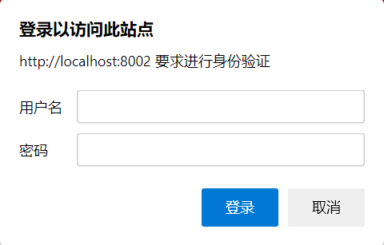

[TOC]


# 1、关于登录

## 1.1、form-login元素

http元素下的form-login元素是用来定义表单登录信息的。当我们什么属性都不指定的时候Spring Security会为我们生成一个默认的登录页面。如果不想使用默认的登录页面，我们可以指定自己的登录页面。

```xml
<security:http auto-config="true">
	<security:form-login  xxx其他属性   />
</security:http>       
```

### 1.1.1、自定义登录页面

#### 1.1.1.1、上下文文件配置

```xml
<security:http auto-config="true">
	<security:form-login  login-page="/login.jsp"
        login-processing-url="/login.do" username-parameter="username"
        password-parameter="password" />
</security:http>
```

自定义登录页面是通过login-page属性来指定的。此外还有其他几个属性：

- login-processing-url：表示登录时提交的地址，默认是“/j-spring-security-check”。这个只是Spring Security用来标记登录页面使用的提交地址，真正关于登录这个请求是不需要用户自己处理的。
- username-parameter：表示登录时用户名使用的是哪个参数，默认是“j_username”
- password-parameter：表示登录时密码使用的是哪个参数，默认是“j_password”

此外还需要一个问题，之前配置的是所有的请求都需要ROLE_USER权限，同理“/login.jsp”也需要该权限，而登录界面是应该对外开放的，这就陷入了一个死循环。解决办法是给“/login.jsp”放行，通过指定“/login”的访问权限为“**ROLE_ANONYMOUS**”或者“**IS_AUTHENTICATED_ANONYMOUSLY**”可以达到我们想要的效果。配置方式如下：

是否需要用户具备什么权限才可以访问，正常来说我们的登录界面是对外开放的，所有人都可以访问。

```xml
<security:http auto-config="true">
	<security:form-login  login-page="/login.jsp"
        login-processing-url="/login.do" username-parameter="username"
        password-parameter="password" />
    <!--匿名配置，对所有人开发权限-->
    <security:intercept-url pattern="/login.jsp" access="ROLE_ANONYMOUS"/>
	<!--所有界面需要具备“ROLE_USE”权限才可以访问-->
    <security:intercept-url pattern="/**" access="ROLE_USER" />
</security:http>
```

此外还有一种方式通过指定一个http元素的安全性为none来达到相同的效果，配置方式如下：

```xml
<security:http security="none" pattern="/login.jsp" />
<security:http auto-config="true">
      <security:form-login login-page="/login.jsp"
         login-processing-url="/login.do" username-parameter="username"
         password-parameter="password" />
      <security:intercept-url pattern="/**" access="ROLE_USER" />
</security:http>
```

 它们两者的区别是前者将进入Spring Security定义的一系列用于安全控制的filter，而后者不会。当指定一个http元素的security属性为none时，表示其对应pattern的filter链为空。从Spring 3.1版本开始，Spring Security允许我们定义多个http元素以满足针对不同的pattern请求使用不同的filter链。当为指定pattern属性时表示对应的http元素定义将对所有的请求发生作用。

#### 1.1.1.2、登录界面

[login.jsp](../../spring-security-xml/security-02-login/src/main/webapp/login.jsp)

### 1.1.2、自定义登录成功之后处理

#### 1.1.2.1、通过default-target-url指定成功界面

默认情况下，我们在登录成功后会返回到原本受限制的页面。但如果用户是直接请求登录页面，登录成功后应该跳转到哪里呢？默认情况下它会跳转到当前应用的根路径，即欢迎页面。通过指定form-login元素的default-target-url属性，我们可以让用户在直接登录后跳转到指定的页面。如果想让用户不管是直接请求登录页面，还是通过Spring Security引导过来的，登录之后都跳转到指定的页面，我们可以通过指定form-login元素的always-use-default-target属性为true来达到这一效果。

```xml
<security:http auto-config="true">
    <security:form-login login-page="/login.jsp" login-processing-url="/login.do"
                         username-parameter="username" 
                         password-parameter="password"
                         default-target-url="/index.jsp"
                         always-use-default-target="true"/>
    <security:intercept-url pattern="/login.jsp" access="ROLE_ANONYMOUS"/>
    <security:intercept-url pattern="/index.jsp" access="ROLE_ANONYMOUS"/>
    <security:intercept-url pattern="/**" access="ROLE_USER"/>
</security:http>
```

#### 1.1.2.2、通过authentication-success-handler-ref指定成功处理器

> ```
> Reference to an AuthenticationSuccessHandler bean which should be used to handle a successful authentication request. Should not be used in combination withdefault-target-url (or always-use-default-target-url) as the implementation should always deal with navigation to the subsequent destination
> ```

authentication-success-handler-ref对应一个AuthencticationSuccessHandler实现类的引用。如果指定了authentication-success-handler-ref，登录认证成功后会调用指定AuthenticationSuccessHandler的onAuthenticationSuccess方法。我们需要在该方法体内对认证成功做一个处理，然后返回对应的认证成功页面。使用了authentication-success-handler-ref之后认证成功后的处理就由指定的AuthenticationSuccessHandler来处理，之前的那些default-target-url之类的就都不起作用了。

```java
public class AuthenticationSuccessHandlerImpl implements AuthenticationSuccessHandler {
    @Override
    public void onAuthenticationSuccess(HttpServletRequest request, 
                                        HttpServletResponse response,
                                        Authentication authentication) throws IOException, ServletException {
        String jsonData = "{'outCode':'202','outMsg':'认证成功'}";
        response.setContentType(MediaType.APPLICATION_JSON_VALUE);
        response.setCharacterEncoding(StandardCharsets.UTF_8.displayName());
        PrintWriter writer = response.getWriter();
        writer.write(jsonData);
    }
}
```
```xml
<security:http auto-config="true">
    <security:form-login login-page="/login.jsp" login-processing-url="/login.do"
                         username-parameter="username" 
                         password-parameter="password"
                         authentication-success-handler-ref="authSuccessHandler"/>
    <security:intercept-url pattern="/login.jsp" access="ROLE_ANONYMOUS"/>
    <security:intercept-url pattern="/**" access="ROLE_USER"/>
</security:http>                                              
<bean id="authSuccessHandler" class="com.github.security.AuthenticationSuccessHandlerImpl"/>                                                            
```


### 1.1.3、自定义登录失败之后处理

 除了可以指定登录认证成功后的页面和对应的AuthenticationSuccessHandler之外，form-login同样允许我们指定认证失败后的页面和对应认证失败后的处理器AuthenticationFailureHandler。

#### 1.1.3.1、通过authentication-failure-url指定失败界面

默认情况下登录失败后会返回登录页面，我们也可以通过form-login元素的authentication-failure-url来指定登录失败后的页面。需要注意的是登录失败后的页面跟登录页面一样也是需要配置成在未登录的情况下可以访问，否则登录失败后请求失败页面时又会被Spring Security重定向到登录页面。

```xml
<security:http auto-config="true">
    <security:form-login login-page="/login.jsp" 
                         login-processing-url="/login.do"
                         username-parameter="username" 
                         password-parameter="password"
                         authentication-success-handler-ref="authSuccessHandler"
                         authentication-failure-url="/failure.jsp"/>
    <security:intercept-url pattern="/login.jsp" access="ROLE_ANONYMOUS"/>
    <security:intercept-url pattern="/failure.jsp" access="ROLE_ANONYMOUS"/>
    <security:intercept-url pattern="/**" access="ROLE_USER"/>
</security:http>
```

#### 1.1.3.2、通过authentication-failure-handler-ref指定失败处理器

> ```
> Reference to an AuthenticationFailureHandler bean which should be used to handle a failed authentication request. Should not be used in combination with authentication-failure-url as the implementation should always deal with navigation to the subsequent destination
> ```

类似于authentication-success-handler-ref，authentication-failure-handler-ref对应一个用于处理认证失败的AuthenticationFailureHandler实现类。指定了该属性，Spring Security在认证失败后会调用指定AuthenticationFailureHandler的onAuthenticationFailure方法对认证失败进行处理，此时authentication-failure-url属性将不再发生作用。

```java
public class AuthenticationFailureHandlerImpl implements AuthenticationFailureHandler {
    @Override
    public void onAuthenticationFailure(HttpServletRequest request, 
                                        HttpServletResponse response,
                                        AuthenticationException exception) throws IOException, ServletException {
        String jsonData = "{'outCode':'500','outMsg':'认证失败'}";
        response.setContentType(MediaType.APPLICATION_JSON_VALUE);
        response.setCharacterEncoding(StandardCharsets.UTF_8.displayName());
        PrintWriter writer = response.getWriter();
        writer.write(jsonData);
    }
}
```

```xml
<security:http auto-config="true">
    <security:form-login login-page="/login.jsp" login-processing-url="/login.do"
                         username-parameter="username"
                         password-parameter="password"
                         authentication-failure-handler-ref="authFailureHandler"/>
    <security:intercept-url pattern="/login.jsp" access="ROLE_ANONYMOUS"/>
    <security:intercept-url pattern="/**" access="ROLE_USER"/>
</security:http>

<bean id="authFailureHandler" class="com.github.security.AuthenticationFailureHandlerImpl"/>
```

## 1.2、http-basic元素

除了支持form-login的表单登录，其实Spring Security还支持弹窗进行认证。通过定义http元素下的http-basic元素可以达到这一效果。

```xml
<security:http auto-config="true">
    <security:http-basic/>
    <security:intercept-url pattern="/**" access="ROLE_USER" />
</security:http>
```

 此时，如果我们访问受Spring Security保护的资源时，系统将会弹出一个窗口来要求我们进行登录认证。效果如下:



当然此时我们的表单登录也还是可以使用的，只不过当我们访问受包含资源的时候Spring Security不会自动跳转到登录页面。这就需要我们自己去请求登录页面进行登录。

需要注意的是当我们同时定义了http-basic和form-login元素时，form-login将具有更高的优先级。即在需要认证的时候Spring Security将引导我们到登录页面，而不是弹出一个窗口。
